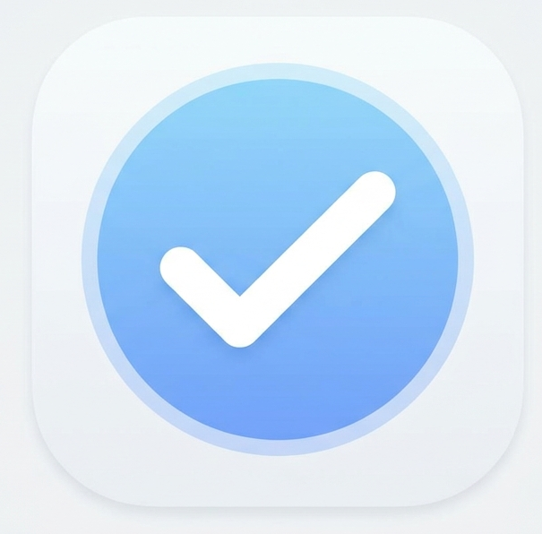

<div align="center">



# TodoList ✓

**An AI-powered, offline-first task manager built with Flutter**  
Natural language input · Arabic & English · Groq LLaMA 3.3 · Cross-platform

[](https://flutter.dev)
[](https://dart.dev)
[](https://groq.com)
[](LICENSE)
[](https://mhmdsabeer2029.github.io/Todo-List-MobileApp/)

</div>

---

## 📱 Live Web Demo

> Try the full app in your browser — rendered inside a phone shell:

**[🚀 Open Live Demo](https://mhmdsabeer2029.github.io/Todo-List-MobileApp/)**

---

## ✨ Overview

TodoList is a production-quality task manager that combines a clean Todoist-inspired UI with the power of Groq's ultra-fast LLaMA 3.3 70B model. It understands natural language in **Egyptian Arabic colloquial, Modern Standard Arabic, and English** — letting you add tasks exactly the way you think them, without forcing you into rigid forms.

The app is **offline-first**: all data lives on your device (SQLite on mobile, SharedPreferences on web). The AI layer is purely additive — the app works completely without an API key, and every AI suggestion is advisory only; nothing is ever applied without your confirmation.

---

## 🚀 Features

### 🧠 AI-Powered Task Parsing (Groq + LLaMA 3.3 70B)

The core superpower of the app. Type or speak naturally and the AI extracts every task attribute automatically.

- **Egyptian Arabic colloquial understanding** — phrases like `"انا عندي ميتينج الساعة 4 العصر #p1"` are fully parsed
- **Automatic attribute extraction** — title, due date, due time, project, labels, priority, recurrence, and reminder minutes are all detected from free-form text
- **Context-aware project/label matching** — the AI matches against your _existing_ project and label names instead of inventing new ones
- **Bilingual** — seamlessly switches between Arabic and English mid-sentence
- **Retry with exponential backoff** — transient network failures are retried automatically (400ms → 800ms), 4xx errors are surfaced immediately without wasting calls
- **Graceful degradation** — if no API key is configured, the built-in NLP parser handles offline parsing

### 💬 Dual-Layer Natural Language Input

Two parsers work in tandem for maximum reliability:

**Groq AI Parser (primary)**

- Full semantic understanding of Arabic and English
- Understands slang, colloquialisms, and implicit dates (`"بكره"` = tomorrow, `"اليوم"` = today, `"النهاردة"` = today)
- Handles relative and absolute times (`"الساعة 3 العصر"` → `15:00`)
- Detects recurrence patterns (`"every week"`, `"daily"`, `"monthly"`)

**NLP Parser (offline fallback)**

- Regex-based, zero-latency, works fully offline
- Parses `#project` tags, `@label` tags, `p1/p2/p3/p4` priority flags
- Detects `!!!` (P1), `!!` (P2), `!` (P3) shorthand priorities
- Parses `"tomorrow"`, `"today"`, `"next monday"`, `"next week"` relative dates
- Detects `"every day"`, `"every week"`, `"every month"` recurrence

### 🎙️ Voice Input (Mobile)

- Live, streaming speech-to-text via `speech_to_text` — partial results appear word-by-word as you speak
- Hold-to-speak UX in the Quick Add sheet — `"Hold to speak"` button with real-time feedback
- Parsed immediately by Groq after release — the full NLP pipeline runs on the voice transcript
- Localized for Arabic (`ar-EG` locale by default)
- Gracefully disabled on web with a no-op stub — no crashes, no error banners

### ⚡ Quick Add Sheet

A bottom sheet accessible from any screen (FAB button) that acts as the primary task entry point:

- Auto-focuses on open for zero-friction capture
- Live NLP preview — as you type, parsed attributes (date, priority, project, labels) appear as chips below the input
- **Calendar date picker** in the toolbar — explicit picks always override inferred dates
- **Time picker** in the toolbar
- **Voice input** button (mobile only)
- **Project selector** — dropdown of all your projects
- Submits with `Enter` key or the send button
- Groq parsing is triggered on submit; NLP parser gives instant feedback while typing

### 🔍 AI-Powered Smart Search

Search goes beyond plain substring matching:

- Natural language queries like `"overdue work tasks this week"` or `"مهام الشغل المتأخرة"`
- Groq parses the query into structured filters: `keywords`, `project`, `label`, `priority`, `dueWithinDays`, `overdueOnly`, `completedOnly`
- Filters are applied against the in-memory task store for instant results
- Falls back to fuzzy substring search if Groq is not configured

### ✅ Task Management

Full-featured task model with every field you'd expect:

| Field           | Details                                                     |
| --------------- | ----------------------------------------------------------- |
| **Title**       | Free text, up to any length                                 |
| **Description** | Multi-line notes per task                                   |
| **Priority**    | P1 (Urgent) → P4 (Normal), color-coded red/orange/blue/gray |
| **Due Date**    | Any date, with overdue detection                            |
| **Due Time**    | Specific time within the due date                           |
| **Project**     | Assigned to any project (defaults to Inbox)                 |
| **Labels**      | Multiple color-coded labels per task                        |
| **Subtasks**    | Nested child tasks under any parent task                    |
| **Sections**    | Group tasks within a project by section                     |
| **Comments**    | Per-task comment thread                                     |
| **Recurrence**  | Daily, weekly, monthly (auto-regenerates on completion)     |
| **Reminder**    | Push notification N minutes before due (mobile)             |

**Task interactions:**

- Swipe left to **delete**, swipe right to **complete** (flutter_slidable)
- Tap to open full **Task Detail Sheet** with all fields editable inline
- Long-press to **reorder** tasks within a project
- Check off with a single tap — animated completion feedback with haptic response

### 📋 Task Views

**Today** — Tasks due today + all overdue tasks, sorted by priority. Badge count on tab and drawer.

**Inbox** — All tasks not assigned to a specific project. The default landing zone for quick captures.

**Upcoming** — Timeline view of tasks with due dates in the next 30 days, grouped by day.

**Completed** — Full history of completed tasks, filterable by date range. Shows completion timestamps.

**Projects** — Dedicated screen per project showing all active tasks organized by section.

**Search** — AI-powered cross-project search across all tasks.

### 📁 Projects

- Create projects with a custom **name**, **color** (hex picker), and **emoji** icon
- Mark projects as **favorites** — favorites appear at the top of the side drawer with quick access
- **Archive** projects to remove them from active views without deleting data
- Sections within projects to further organize tasks (Kanban-style grouping)
- **Task count badges** — active task counts shown on every project in the drawer
- Delete project → tasks are automatically reassigned to Inbox (never lost)
- Project progress stats available in the project detail screen

### 🏷️ Labels

- Create and manage color-coded labels
- Assign multiple labels to any task
- Labels are displayed as colored chips throughout the UI
- Label management screen with inline edit/delete
- The AI parser reuses your existing label names instead of creating duplicates

### 🔔 Notifications (Mobile)

- **Task reminders** — scheduled push notification N minutes before a task's due time
- **Daily digest** — configurable morning summary notification at a chosen time (default 09:00)
- **Badge count** — home screen badge with active task count (iOS)
- All notifications are cancelled/rescheduled automatically when tasks are edited or deleted
- Web: full no-op stub — notifications are silently skipped without any errors

### 🔧 AI Maintenance (Smart Housekeeping)

A dedicated screen that asks Groq to review your workspace and flag issues:

- **Duplicate project detection** — finds near-duplicate project names (`"Work"` vs `"work stuff"`)
- **Duplicate label detection** — same for labels
- **Stale task review** — tasks that have been sitting without a due date for 60+ days
- **Underused label identification** — labels that don't appear meaningfully distinct
- Every suggestion is **advisory only** — nothing is ever applied automatically; each suggestion links to the relevant screen for you to review and act

### 📊 Productivity Stats

A stats dashboard embedded in the Settings screen:

- **Completed Today / This Week / This Month** counts
- **Current streak** — how many consecutive days you've completed at least one task
- **Karma score** — gamified productivity score (`completedThisMonth × 10 + streak × 5`)
- **7-day bar chart** — completed vs. added tasks per day, rendered with fl_chart
- Stats update live whenever tasks are completed anywhere in the app

### 🔐 Authentication

- **Google Sign-In** — OAuth2 flow via `google_sign_in`, with profile display in Settings
- **Guest / Skip mode** — fully persisted via SharedPreferences; the app is 100% usable without an account; "Skip for now" survives app restarts
- **Anonymous account support** — email/password auth scaffold in place
- Account state drives access to Google Sheets import

### 📥 Google Sheets Import

For Google-signed-in users, import tasks directly from a spreadsheet:

- Lists all Google Sheets in the user's Drive via the Drive v3 API
- Fetches every tab's cell values via the Sheets v4 API
- Sends the raw row data to Groq, which extracts task candidates (title, due date, priority, project, labels, notes) row by row
- Shows a review checklist — select/deselect individual rows before importing
- Creates all selected tasks in one batch

### 🌙 Theming

- **Dark mode**, **Light mode**, and **System** (follows device setting)
- Consistent Material 3 design system throughout
- Custom color palette: brand red `#DC4C3E`, with priority colors (P1 red, P2 orange, P3 blue, P4 gray)
- `NavigationBar` + side `Drawer` dual navigation model

### 🌐 Web Support

The app builds and runs as a Flutter Web app deployed on GitHub Pages:

- **SQLite → SharedPreferences** swap via conditional Dart imports — zero code changes needed
- **Notifications stub** — `flutter_local_notifications` replaced by no-op class on web
- **Voice stub** — `speech_to_text` + `permission_handler` replaced by no-op class on web
- Phone shell UI on desktop — the web build renders inside a CSS phone frame with dynamic island, volume buttons, and power button
- Responsive: full-screen on mobile browsers, phone shell on desktop

### 📦 Onboarding

3-screen onboarding flow (skippable) for first-time users:

- Screen 1: Arabic welcome introducing the app concept
- Screen 2: Live NLP demo showing how Egyptian Arabic input is parsed
- Screen 3: Feature highlights (reminders, projects, labels)
- Completion state persisted — never shown again after first run

---

## 🏗️ Architecture

```
lib/
├── main.dart                    # App entry, initialization, auth routing
├── app_shell.dart               # Bottom nav + side drawer shell
├── constants/
│   └── theme.dart               # Material 3 theme (light + dark), colors, spacing
├── models/
│   └── index.dart               # Task, Project, Label, Section, Comment, Settings, Stats
├── store/
│   ├── task_store.dart          # ChangeNotifier — all task state & filtering
│   ├── project_store.dart       # ProjectStore + LabelStore
│   ├── label_store.dart         # Re-export of LabelStore
│   ├── auth_store.dart          # Auth state (Google / anonymous / guest)
│   └── settings_store.dart      # App settings persistence
├── db/
│   ├── app_database.dart        # Conditional import selector
│   ├── database.dart            # SQLite implementation (mobile/desktop)
│   └── database_web.dart        # SharedPreferences JSON implementation (web)
├── screens/
│   ├── today_screen.dart        # Today + overdue tasks
│   ├── inbox_screen.dart        # Unassigned tasks
│   ├── upcoming_screen.dart     # Date-grouped timeline
│   ├── search_screen.dart       # AI-powered search
│   ├── completed_screen.dart    # Completion history
│   └── settings_screen.dart     # Settings + stats dashboard
├── features/
│   ├── auth/login_screen.dart   # Google Sign-In + skip
│   ├── onboarding/              # 3-screen onboarding
│   ├── projects/                # Project list, create, detail screens
│   ├── labels/                  # Label management screen
│   ├── maintenance/             # AI housekeeping screen
│   └── sheets_import/           # Google Sheets import screen
├── widgets/
│   ├── quick_add_sheet.dart     # FAB → bottom sheet task entry
│   ├── task_item.dart           # Swipeable task row
│   ├── task_detail_sheet.dart   # Full task editor sheet
│   ├── reschedule_sheet.dart    # Date/time picker sheet
│   ├── priority_badge.dart      # P1/P2/P3/P4 chip
│   └── empty_state.dart         # Zero-state illustrations
└── utils/
    ├── groq_service.dart        # Groq API: parse, search, subtasks, maintenance
    ├── nlp_parser.dart          # Offline regex NLP parser
    ├── voice_service.dart       # Live streaming STT (mobile)
    ├── voice_service_platform.dart  # Conditional import (mobile vs web)
    ├── notification_service.dart    # Conditional import (mobile vs web)
    ├── notifications.dart           # Real notifications (mobile)
    ├── google_auth_service.dart     # Google Sign-In + Drive/Sheets API
    ├── sheets_import_service.dart   # Groq-powered sheet-to-tasks parser
    ├── stats_engine.dart            # Productivity metrics
    ├── date_utils.dart              # Date formatting helpers
    ├── local_secrets.dart           # API key (gitignored)
    └── stubs/
        ├── notifications_stub.dart  # No-op for web
        └── voice_stub.dart          # No-op for web
```

**State management:** `ChangeNotifier` + `AnimatedBuilder` — no external state library, intentionally lightweight.

**Database strategy:**

- Mobile/Desktop → SQLite via `sqflite` with full relational schema (tasks, projects, labels, task_labels, sections, comments)
- Web → JSON blobs in `SharedPreferences`, same API surface

---

## 🛠️ Getting Started

### Prerequisites

- Flutter `>=3.24.5` (stable channel)
- Dart `>=3.3.0`
- A [Groq API key](https://console.groq.com) (free tier available — optional but recommended)

### 1. Clone

```bash
git clone https://github.com/mhmdsabeer2029/Todo-List-MobileApp.git
cd Todo-List-MobileApp
```

### 2. Install dependencies

```bash
flutter pub get
```

### 3. Add your Groq API key

Create `lib/utils/local_secrets.dart` (this file is gitignored):

```dart
const String kLocalGroqApiKey = 'gsk_your_key_here';
```

Or pass it at build time:

```bash
flutter run --dart-define=GROQ_API_KEY=gsk_your_key_here
```

> Without a key, the app runs fully — AI features show a gentle "not configured" message and the offline NLP parser handles all input.

### 4. Run

```bash
# Mobile (Android/iOS)
flutter run

# Web
flutter run -d chrome

# Release web build
flutter build web --release --web-renderer canvaskit --dart-define=GROQ_API_KEY=gsk_your_key_here
```

---

## 📦 Dependencies

| Package                       | Version  | Purpose                                       |
| ----------------------------- | -------- | --------------------------------------------- |
| `sqflite`                     | ^2.3.2   | SQLite database (mobile)                      |
| `shared_preferences`          | ^2.2.3   | Key-value storage + web DB                    |
| `flutter_slidable`            | ^3.1.0   | Swipe-to-complete / swipe-to-delete           |
| `flutter_local_notifications` | ^17.1.2  | Task reminders + daily digest (mobile)        |
| `timezone`                    | ^0.9.4   | Scheduled notifications with timezone support |
| `speech_to_text`              | ^6.6.2   | Live streaming voice input (mobile)           |
| `permission_handler`          | ^11.3.1  | Microphone permission (mobile)                |
| `google_sign_in`              | ^6.2.1   | Google OAuth2 authentication                  |
| `http`                        | ^1.2.2   | Groq API + Google Drive/Sheets API calls      |
| `fl_chart`                    | ^0.68.0  | 7-day productivity bar chart                  |
| `uuid`                        | ^4.3.3   | Unique IDs for all entities                   |
| `intl`                        | ^0.19.0  | Date/time formatting + localization           |
| `haptic_feedback`             | ^0.5.1+1 | Completion haptics (mobile)                   |
| `collection`                  | ^1.18.0  | Dart collection utilities                     |
| `url_launcher`                | ^6.3.1   | Open links from within the app                |
| `path`                        | ^1.8.3   | SQLite file path construction                 |

---

## 🤝 Contributing

Pull requests are welcome. For major changes, please open an issue first to discuss what you'd like to change.

1. Fork the repository
2. Create your feature branch (`git checkout -b feature/amazing-feature`)
3. Commit your changes (`git commit -m 'Add some amazing feature'`)
4. Push to the branch (`git push origin feature/amazing-feature`)
5. Open a Pull Request

---

## 📄 License

see the [LICENSE](LICENSE) file for details.

---

<div align="center">

&copy; 2026 Mohamed Saber — Powered by [Groq](https://groq.com)

</div>
